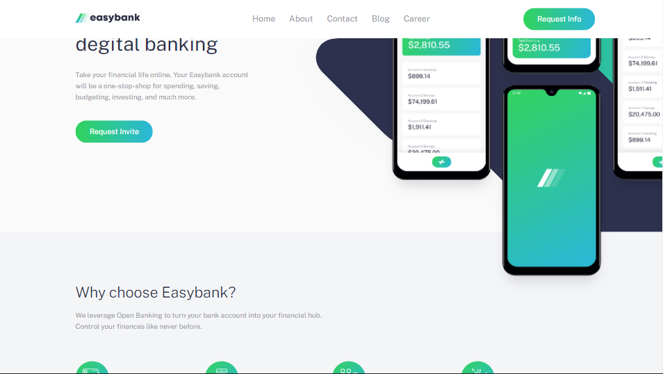

<h3 align="center">Easybank Landing page</h3>

---

 Easybank landing page is an intermediate challenge on frontend mentor I made for practice and
     
    Polishing my skills in creating efficient code for flexible future changes and responsive friendly experince.

## 📝 Table of Contents

- [About](#about)
- [Getting Started](#getting_started)
- [Usage](#usage)
- [Built Using](#built_using)
- [Authors](#authors)
- [Acknowledgments](#acknowledgement)

## 🧐 About 

The project is actually an intermediate challenge on frontend mentor. That website is popular with helping frontend developers reach their goal in being the skillful person who they want to be.

I made the project and made it identical as much as I could. I can't say it was easy but it was actually entertaining and challenging. Too much happiness was there while I was making it.

## 🏁 Getting Started 

All what you net to start the project is to open the index.html file. No need to setup or install any libraries. You don't have to npm init.

These instructions will get you a copy of the project up and running on your local machine for development and testing purposes. See [deployment](#deployment) for notes on how to deploy the project on a live system.

### Prerequisites

There is actually nothing you should install to run the project and reuse it. You have every thing ready to work.

## 🎈 Usage 

The website is only reponsive in two media-sizes:

- 375 px (mid-mobile size);
- 1440 px (desktop)

The reason for that is that the challenge and the images came with it were only targeting those two sizes only.

## ⛏️ Built Using 

- [Google fonts](https://fonts.googleapis.com) - google fonts
- [Jquery](https://code.jquery.com) - Jquery
- [Sass compiler] - sass

## ✍️ Authors 

- [@menoo20](https://github.com/menoo20) - Idea & Initial work

## 🎉 Acknowledgements 

- Inspiration: inspired by EL-zero webschool which is the gift why I learned all of I what I know.
- References: frontmento.io
